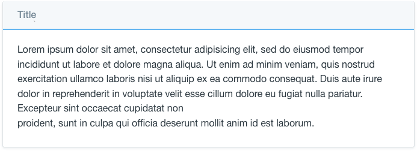
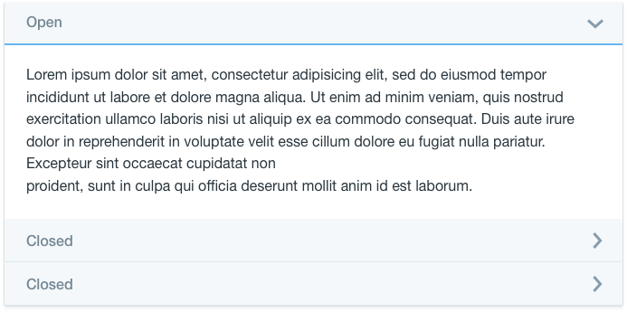
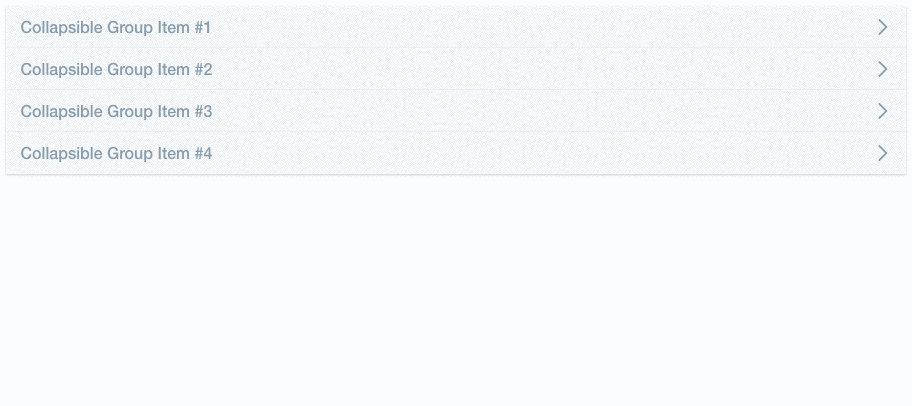

## Definition

Panels help to separate your content.

## Usage

Panel are use to help separating content a making processes as reading or filling a form easier to the user. Panels are a way of chunking into smaller pieces.

### Configuration

Panels can be configured in different ways:

**Body**

**Header + body**

TODO description

**Header + body + footer**

TODO NOTE: Are we using panel states somewhere?

### Variations

#### Accordion

Panels can be collapsible. Whenever there is a collapsible panel the header must include a disclosure icon as an affordance to let the user understand that open and close actions can be performed. Please, see that when a panel is open the header is highlighted with a blue line below it marking the active state.

In the following example you can see the accordion working. It is also optional to close all entries when a diferent entry opens.

